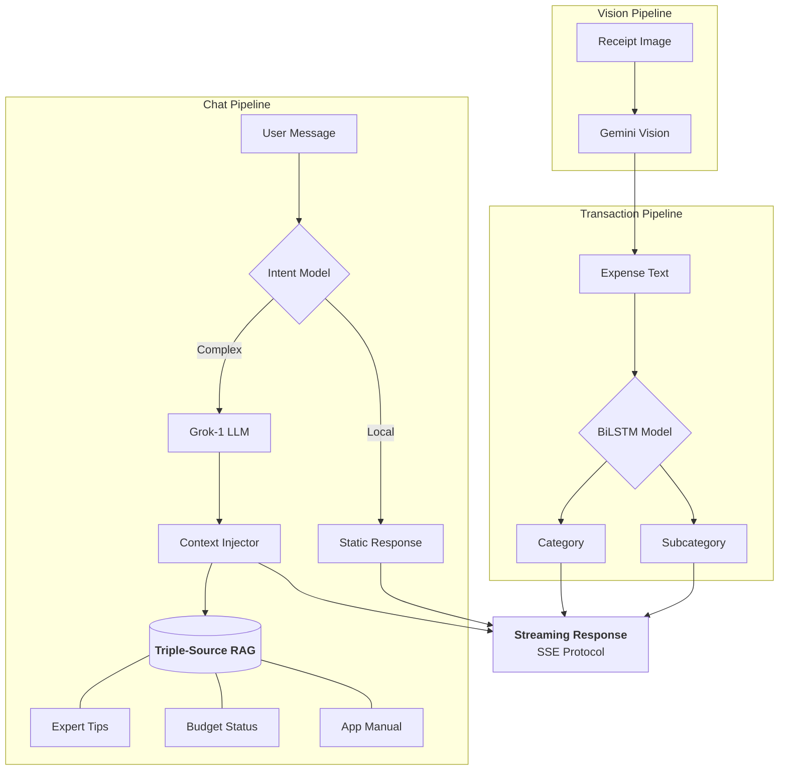

# 🐻 Beruang Server

<div align="center">


**🚀 High-Performance Orchestrator for Beruang Personal Finance**

*Intelligent Hybrid AI • Streaming SSE Support • Triple-Source RAG • Logic-Proof Categorization*

[Features](#-features) • [Installation](#-installation) • [API](#-api-endpoints) • [Architecture](#-architecture) • [Configuration](#-configuration)

</div>

---

## 📋 Overview

Beruang Server is the centralized intelligence hub for the [Beruang App](https://github.com/izwanGit/Beruang). It orchestrates a high-precision local AI stack with advanced cloud-based LLMs to provide a seamless, secure, and deeply personalized financial experience.

### 🧠 The Unified AI Flow
Beruang Server doesn't just "talk"; it thinks. Every query is filtered through a multi-stage routing engine to ensure 0ms latency for local tasks and deep reasoning for complex advice.



---

## ✨ Features

### 💬 Hybrid Chatbot Intelligence
- **Intelligent Routing**: Automatically distinguishes between "Where is my profile?" (Local) and "Is my spending healthy?" (Cloud).
- **App-Help Whitelist**: Specialized pre-filter regex patterns ensure that queries like "how to save in this app" bypass aggressive red-flag filters and reach local help intents.
- **Streaming Support**: Real-time Server-Sent Events (SSE) for that "human-like" typing experience.
- **Connection Warm-up**: AI models and API connections are "pre-heated" on boot to eliminate cold-start delays.

### 🏷️ V1.0 Transaction Engine
- **99.61% Accuracy**: Powered by our "Gold Standard" 334k-row logic-proof dataset.
- **Malaysian Context**: Expertly recognizes Zakat, Touch n Go, Grab, Shopee, and local street food.
- **Logic-Proof**: No nonsensical pairings—the model understands the semantic difference between "needs" and "wants" in a local context.

### 📸 Smart Receipt Processing
- **Gemini Vision AI**: Extracts merchant, total, date, and items with extreme precision.
- **Auto-Mapping**: Immediately maps extracted items to the correct financial categories.

### 📚 Triple-Source RAG (Retrieval-Augmented Generation)
1. **DOSM Data**: Real Malaysian poverty line and median income statistics.
2. **Expert Tips**: 388+ curated financial advice snippets.
3. **App Manual**: Perfect technical guidance on how to use every Beruang feature.

---

## 🚀 Installation

### Prerequisites
- **Node.js**: v18+
- **API Keys**: OpenRouter (Grok) & Google Gemini

### Setup
```bash
git clone https://github.com/izwanGit/beruang-server.git
cd beruang-server
npm install

# Configure Environment
cp .env.example .env
# Add your OPENROUTER_API_KEY and GOOGLE_GENAI_API_KEY
```

### Execution
```bash
# Development (Auto-reload)
npm run dev

# Production
npm start
```

---

## 🔌 API Endpoints

### 📡 AI Pipelines
- `POST /chat/stream`: The flagship streaming endpoint for the chatbot.
- `POST /predict-transaction`: Batch process descriptions for 99.61% categorization.
- `POST /scan-receipt`: Gemini Vision powered OCR and categorization.
- `POST /predict-intent`: Pure intent detection for UI routing.

---

## 🏗️ Architecture Stack

| Layer | Technology | Purpose |
| :--- | :--- | :--- |
| **Runtime** | Node.js / Express | Fast, non-blocking I/O |
| **Local AI** | TensorFlow.js / MiniLM | Intent & Transaction detection |
| **Cloud AI** | Grok-1 (Llama-based) | Complex reasoning & financial advice |
| **Vision** | Google Gemini 1.5 | Receipt OCR & Item extraction |
| **Speed** | SSE / Warmup Scripts | Real-time performance |

---

## 📜 Final Year Project (FYP) Credits
Developed as the backend infrastructure for the Beruang ecosystem.

**Developer**: Muhammad Izwan bin Ahmad  
**Supervision**: Dr. Khairulliza binti Ahmad Salleh  
**Institution**: Universiti Teknologi MARA (UiTM)

---

<div align="center">

**Made with 🐻 by Izwan**

*"Beruang" sounds like "Ber-wang" (having money). Let's build your wealth together.*

</div>
